# CloudsProject
### Cel projektu:
1. Stwórz aplikację webową lub wykorzystaj istniejącą aplikację, która spełnia następujące
wymagania:
• Składa się z oddzielnych serwisów dla backendu i frontend.
• Umożliwia wymianę wiadomości między dwoma wybranymi użytkownikami.
• Umożliwia podgląd globalnej listy użytkowników.
2. Dodaj do wybranej aplikacji następujące funkcjonalności:
• Autentykację oraz autoryzację z wykorzystaniem AWS Cognito.
• Integrację z relacyjną bazą danych (Amazon RDS).
3. Utwórz pliki Dockerfile dla frontendu i backendu.
4. Utwórz plik docker-compose.yml do konfiguracji całego środowiska.
5. Skonfiguruj VPC (Virtual Private Cloud) i ustal odpowiednie reguły bezpieczeństwa.
6. Wdróż aplikację z wykorzystaniem EC2 oraz interfejsu webowego AWS.
7. Wdróż aplikację z wykorzystaniem EC2 oraz Terraform.
8. Opisz cały proces wdrożenia w formie instrukcji.

### Aplikacja webowa
Została napisana w React z wykorzystaniem socket.io do wymiany wiadomości pomiędzy użytkownikami oraz amplify w celu autoryzacji użytkownika poprzez cognito.\
Backend został napisany z wykorzystanie node js.

### Cognito
Cognito zostało utworzone w sposób "no hosted ui", co uniknęło potrzeby stawiania własnej strony do logowania (został użytyw gotowy template) oraz nie było potrzeby wymiany certyfikatów frontend-backend jako, że działa ona dalej w obrębie http.\
Ustawienie hasła dla użytkowników:\
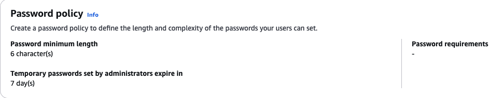


Ustawienia dotyczące rejestracji użytkownika oraz jego potwierdzenia - użytkownik może sam się potwierdzić poprzez podanie kody wysłanego na jego skrzynkę mailową\
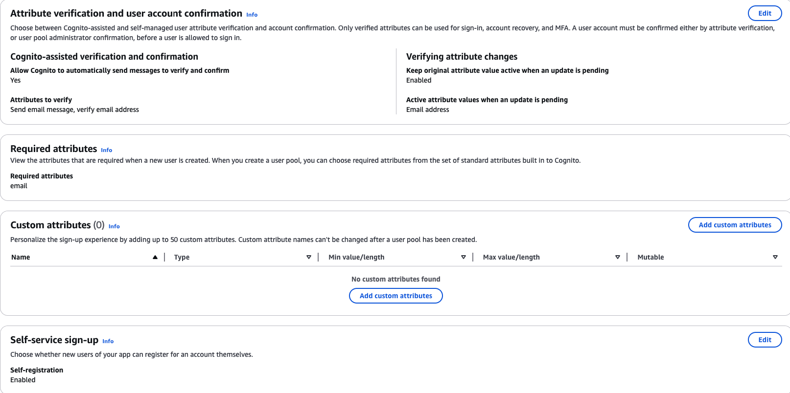


Lambda, która triggeruje dodanie nowo utworzonego użytkownika do AWS RDS data base\
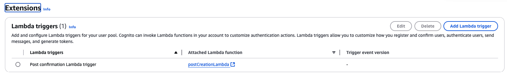


### RDS
Baza danych w postrges została postawiona z wykorzystaniem RDS\
Security groups dostępu do bazy danych\
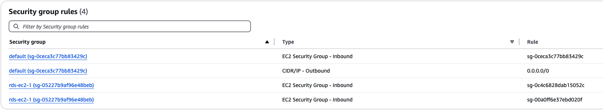

Endpoint, vpc, subnets\
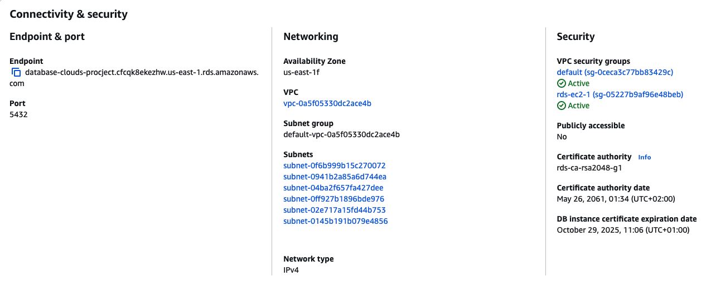

### Lambda
Została dodana lambda, która jest odpalana poprzez trigger dodania nowego użytkownika do cognito
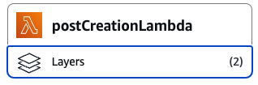

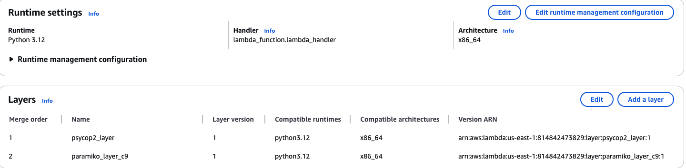
Paramiko layer wykorzystywany był podczas testów


### EC2 isntnces

#### Backend
Maszyna została postawiona z wykorzystaniem typu t2.micro
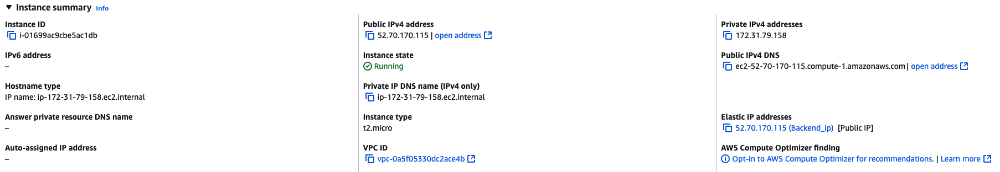

Security groups dla backendu umożliwiają komunikację z RDS oraz frontendem. Dodatkowo można podłączyć się do instnacji poprzez SSH oraz HTTP
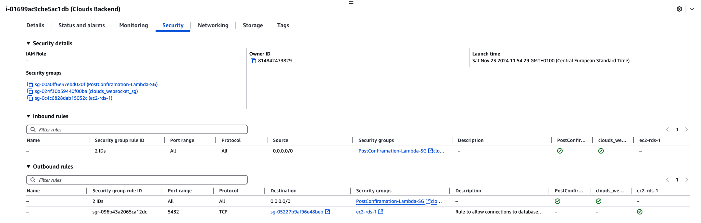

#### Frontend
Security groups dla frontendu umożliwiają komunikację z backendem na porcie 4000 oraz wystawiają komunikację po SSH, port 3000 oraz 80
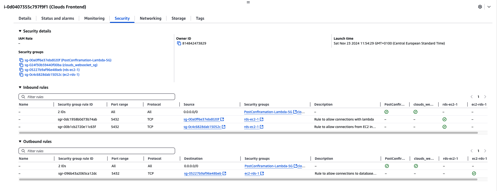

W przypadku frontendu była potrzeba użycia maszyny t2.small ze względu na rozmiar paczek
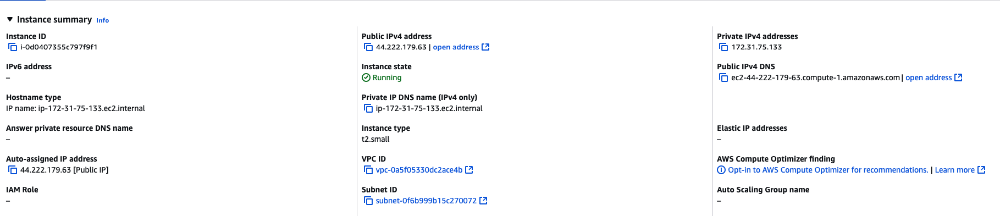
## Notatki / Lista przemyśleń
### Cognito
There is a lambda connected to cognito at post registration which add user to RDS DB
### Bastion
To secure communication with RDS DB (which we want to secure from the world) it is nice to use a some point of fire wall (gate) via additional EC2 instance called Bastion\
Bastion host should be in the same Availability Zone as RDS.\
RDS should has security group that allows communication through that bastion EC2 at designated port (5432)
### Lambda
Nice to know:\
Lambda should has security group that allows communication inboud (can be all traffic) and outbound to RDS port (which is 5432 in this case)\
To be able to connect to RDS based on postgres there is a necessity to add lambda layer for psycopg2-binary. The architecture version at which the library has been build should be the same as the architecture of lambda (the same with python version used to build/download lib)\
At this case it were x86_64 and python3.12
https://repost.aws/knowledge-center/lambda-import-module-error-python

### Docker
Example code how to build and push docker image to ECR
``` bash
docker buildx build --platform linux/amd64 -t 814842473829.dkr.ecr.us-east-1.amazonaws.com/clouds_project:frontend_tf_v2 .
```
``` bash
docker push 814842473829.dkr.ecr.us-east-1.amazonaws.com/clouds_project:frontend_tf_v2  
```
<mark>IMPORTANT</mark>\
At one ECR repository should be only one kind of image. Tags are not supposed to defference them between backend and frontend images :joy:\
But due to lack of time it is mixed right now


### BastionDB
W trakcie realizacji/testowania projektu została wykorzystania dodatkowa maszyna ec2 służąca za bridge pomiędzy bazą danych, aby uniemożliwić bezpośredni dostęp do niej z zewnątrz (dodatkowa ochrona)\
Poniżej znajdują się jej zasady ruchu wejściowego i wyjściowego


## Część z terraform
Podczas realizacji tej części zostały użyte już istniejące wcześniej RDS DB, cognito, lambda oraz security groups oraz vpc w celu połączenia ze sobą maszyn\
W pliku terraform zawarto natomiast instrukcje postawienia maszyn ec2 wraz z ich networkingiem oraz odpaleniem obrazu dockerowego pobranego z ECR
### ECR
Została wykorzystana usługa ECR w celu przechowywania obrazów dockerowych frontedu i backendu. Niestety zostałą wykorzystane tylko jedno tekie repozytorium, a obrazy były rozróżniane od siebie poprzez tag. Powinno być osobne repozytorium dla każdego "typu" obrazu.

## HUGE TROUBLE MAKER
Oh . . .\
So, long story short\
React inject environments while being build so such a backend url which is known after running `terraform apply` can not be inject at that process - static form of application is being used to run. So there has to be other solution to do so.\
And there is, dynamic injection after running docker image - a lot of testing and digging into the code and docker image. Trying to replace occurance with `sed | perl` and `nginx.conf` to inject script into `index.html` after that.\
https://pamalsahan.medium.com/dockerizing-a-react-application-injecting-environment-variables-at-build-vs-run-time-d74b6796fe38
https://medium.com/@rivaifnasution/tutorial-how-to-use-dotenv-in-react-for-beginners-ac79d9b6ddbf

### Future plans
https://medium.com/@ayushunleashed/how-to-build-ecs-ec2-auto-scaling-infrastructure-on-aws-ba730aa076a9